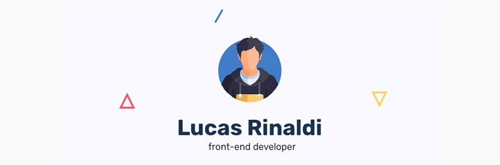

[](https://lucasreinaldi.com.br)

[](https://rinaldilucas.com)
[](https://www.linkedin.com/in/rinaldilucas/)

<br>


Hey there 👋

I'm Lucas, a frontend and full stack developer, creative coder, music lover, pixel art addict and self-taught designer. I make it my mission to translate user-focused designs into pixel-perfect websites or applications that run blazing fast.

Want to know more about me? [Check out my website.](https://rinaldilucas.com)

<br>

## 📌 Pinned Repositories

<a href="https://github.com/rinaldilucas/mean-stack-template">
  
</a>

<br>
<br>

<a href="https://github.com/rinaldilucas/personal-portfolio">
  
</a>

<br>
<br>

<a href="https://github.com/rinaldilucas/node-api-template">
  
</a>

<br>
<br>

<a href="https://github.com/rinaldilucas/improved-linktree-template">
  
</a>

<br>
<br>

<a href="https://github.com/rinaldilucas/compass-template">
  
</a>

<br>
<br>

<a href="https://github.com/rinaldilucas/less-template">
  
</a>

<br>
<br>

<a href="https://github.com/rinaldilucas/flexbox-grid-template">
  
</a>

<br>
<br>

<a href="https://github.com/rinaldilucas/angularjs-template">
  
</a>

<br>
<br>

## &#x1f4c8; GitHub Stats

<br>

<a href="https://github.com/rinaldilucas">
  
</a>

<br>
<br>

<a href="https://github.com/rinaldilucas">
  
</a>

<br>
<br>

## 💼 Skills

#### Frontend


#### Backend


#### Databases


#### Others


<br>

## ✉️ Contact

[](https://rinaldilucas.com)
[](https://github.com/rinaldilucas)
[](mailto:lucasreinaldi@gmail.com)
[](mailto:lucasreinaldi@hotmail.com)
[](https://www.linkedin.com/in/rinaldilucas/)
[](https://t.me/rinaldilucas)

## ☕ Donations

If you feel that this repository helped you in any way, feel free to buy me a coffee!
It helps me a lot to continue developing open source codes.

-   Metamask (USDT):
    ```sh
    0xA0410641515F06fF6a9AdAFf1c3e90a3905ba271
    ```
-   PIX (BRL):
    ```sh
    72140bc8-fadc-42f5-abb6-9c13cc80a59f
    ```
